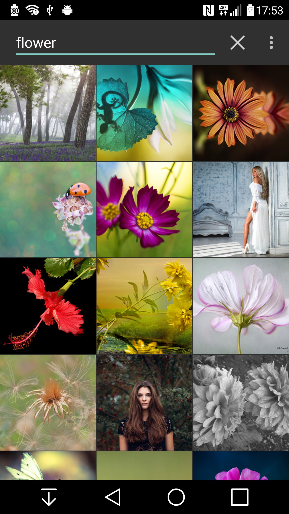
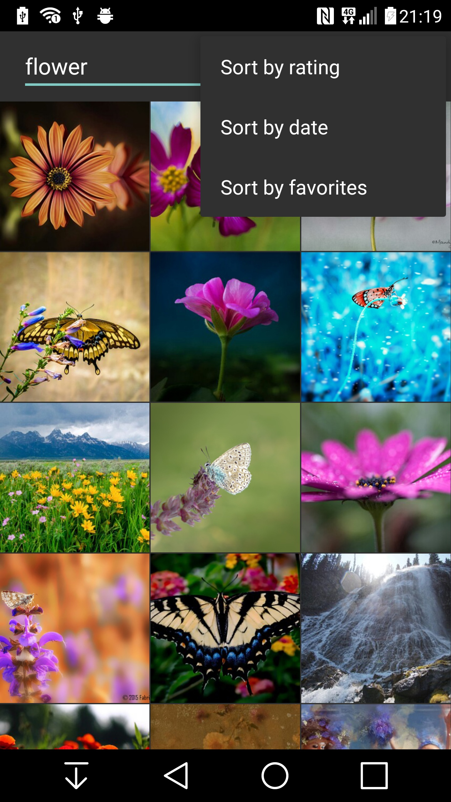

##fhpx-demo

####Simple app to browse [500px](https://500px.com/) photo content using [500px public API](https://github.com/500px/api-documentation).

* Retrieves search results and displays images in gridview. 
* Continually loads images while scrolling down.
* Sort options in overflow menu.

Using **[Retrofit](http://square.github.io/retrofit/)** for API calls and **[Glide](https://github.com/bumptech/glide)** to load images into gridview. Glide was chosen over **[Picasso](http://square.github.io/picasso/)** after trying both for smoother loading of new images while scrolling.

 

 
Each image can be pressed to open it in fullscreen size and zoomed with two-finger touch gesture.

 
